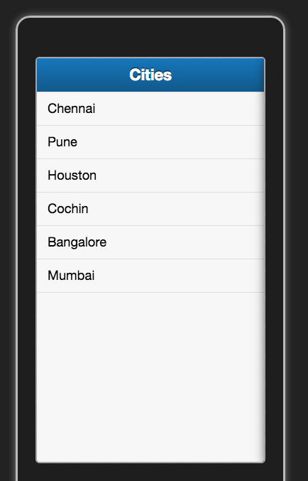
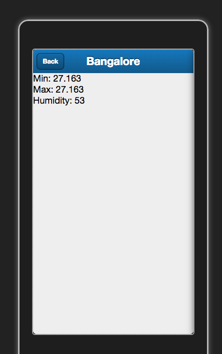

= Lab 01
:source-highlighter: pygments

[abstract]
Create Lab01.html. Implement the application as given below. 

== Screen 1

You will display a list of cities in a list as shown in the screen shot. 

 

The cities list will be fetched from the web server. You can use the following code in your webserver and update it accordingly.

[source,javascript]
----
function getCitiesListInJSON(request,response){
	var data = {
		cities : [
		 {name:"Chennai"},{name:"Pune"},{name:"Houston"},
		 {name:"Cochin"},{name:"Bangalore"},{name:"Mumbai"}
	   ]
	};
	response.end(JSON.stringify(data));
}
----

****
The city list should not be loaded from the server everytime the user access the site. It should be loaded locally after the initial load.
****
== Screen 2

When you tap a city you will show the current temperature of the city in the next screen as shown below.

 

For this you have to connect programmatically to http://api.openweathermap.org/data/2.5/weather?q=cityname&units=metric.

Replace the cityname with the actual city. Study the output initially. You can use the following attributes.

*  main.temp_min
*  main.temp_min
*  main.humidity 
