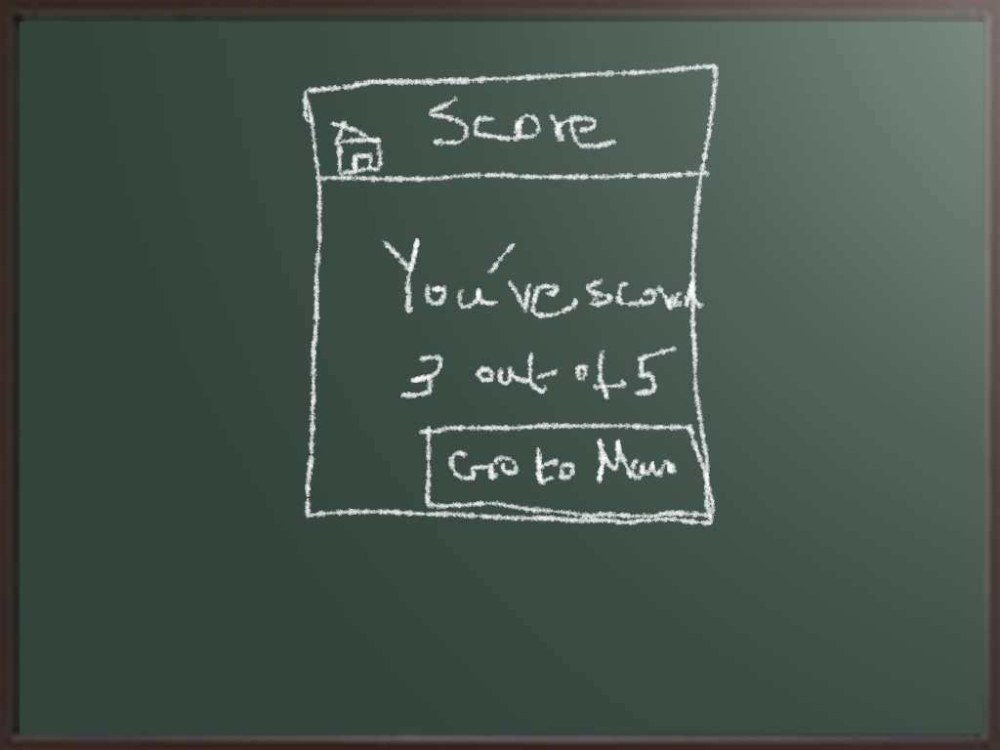

= Lab 01

[abstract]
Create a Sencha Touch application by generating a new project called ‘Quiz’ using Sencha Cmd. The application is a simple arithmetic quiz app. 

== Step: 1

You have to implement your webserver to return 5 simple arithmetic questions with answers, randomly from a set of say 10 questions. When you send the request to /QandA you should send a JSON array of 5 questions. The format of JSON is left to you.

== Step: 2

Implement the screens using Sencha Architect. Take a look at the screen shots.

 +

image:images/02.png[] +

 +

image:images/04.png[] +

In the 'Advanced' screen, when you click buy launch web browser to show 'Google' page for the time being. 
In the final screen you will have to display the scores.

 

